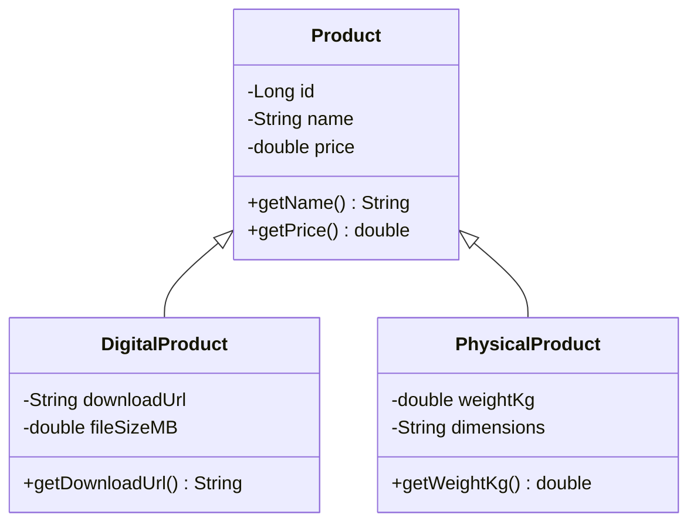

# Product Hierarchy UML Class Diagram

```mermaid
classDiagram
class Product {
    -Long id
    -String name
    -double price
    +getName() String
    +getPrice() double
}

class DigitalProduct {
    -String downloadUrl
    -double fileSizeMB
    +getDownloadUrl() String
}

class PhysicalProduct {
    -double weightKg
    -String dimensions
    +getWeightKg() double
}

Product <|-- DigitalProduct
Product <|-- PhysicalProduct
```
